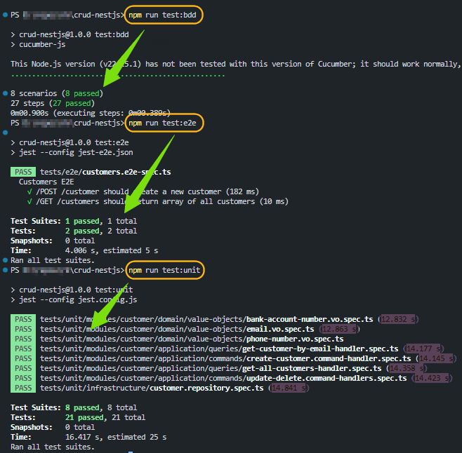

# CRUD-NestJS

A simple, production-style CRUD API built with NestJS, demonstrating Clean Architecture, CQRS, TDD and BDD practices.
<div><i>Developer:   Ramin Bateni Parvar</i></div>

## Architecture & Patterns

- **Clean Architecture**: clear separation of layers (Domain, Application, Infrastructure, Presentation)  
- **Domain-Driven Design**: value objects for `PhoneNumber`, `Email`, `BankAccountNumber`  
- **CQRS**: separate Command and Query handlers  
- **TDD & BDD**:  
  - Unit tests with Jest  
  - End-to-end and feature tests with Cucumber.js  
- **Validation**:  
  - Mobile-only phone validation via `libphonenumber-js`  
  - IBAN format check for bank accounts  
  - Unique constraints on `email`, and on `(firstName, lastName, dateOfBirth)`


## API Documentation

Once the server is running, visit:

```
http://localhost:3000/api
```

to explore endpoints:

- `GET /customers`  
- `GET /customers/:email`  
- `POST /customers`  
- `PUT /customers/:email`  
- `DELETE /customers/:email`  

<div align="center">
	
</div>

### Duplication customer errors - 409

<div align="center">
	
</div>

### Success results and statues codes

<div align="center">
	
</div>

---

### Test results (BDD / Unit / E2E Tests)

<div align="center">
	
</div>

## Features

1. **Full CRUD** for `Customer`  
2. **CQRS**:  
   - `CreateCustomerCommandHandler`, `UpdateCustomerCommandHandler`, `DeleteCustomerCommandHandler`  
   - `GetAllCustomersQueryHandler`, `GetCustomerByEmailQueryHandler`  
3. **Validation & Errors**:  
   - `NotFoundException` (404) on missing records  
   - `409 Conflict` for duplicates (Mongo duplicate-key filter)  
4. **API Documentation** via Swagger UI  
5. **Docker Compose** setup for NestJS + MongoDB
6. Changes are organized into **atomic**, **descriptive Git commits**. Each reflecting a single development step (feature addition, refactoring, or bug fix)—to ensure a clear, maintainable project history.

---

## Getting Started

1. **Install dependencies**  
   ```bash
   npm install
   ```
2. **Run locally**  
   ```bash
   npm run start:dev
   ```
3. **Run tests**  
   - Unit:  
     ```bash
     npm test:unit
     ```  
   - BDD features:  
     ```bash
     npm run test:bdd
   - E2E:  
	 ```bash
	 npm run test:e2e
     ```

---

## Docker

Bring up both the API and MongoDB with one command:

```bash
docker-compose up --build
```
<div align="center">
	
</div>

---

## Debugging

Use `F5` in VSCode (launch configuration) to debug project or BDD / Cucumber features:

<div align="center">
	
</div>

--------------------------------------------------------

# CRUD Code Test 

Please read each note very carefully!
Feel free to add/change the project structure to a clean architecture to your view.
and if you are not able to work on the FrontEnd project, you can add a Swagger UI
in a new Front project.

Create a simple CRUD application with [NestJS](https://nestjs.com/) that implements the below model:
```
Customer {
	FirstName
	LastName
	DateOfBirth
	PhoneNumber
	Email
	BankAccountNumber
}
```

Create a NestJS template project

## Practices and patterns:

- [TDD](https://en.wikipedia.org/wiki/Test-driven_development)
- [BDD](https://en.wikipedia.org/wiki/Behavior-driven_development)
- [DDD](https://en.wikipedia.org/wiki/Domain-driven_design)
- [Clean architecture](https://dev.to/dipakahirav/modern-api-development-with-nodejs-express-and-typescript-using-clean-architecture-1m77)
- [CQRS](https://en.wikipedia.org/wiki/Command%E2%80%93query_separation#Command_query_responsibility_separation) pattern ([Event sourcing](https://en.wikipedia.org/wiki/Domain-driven_design#Event_sourcing)).
- Clean git commits that show your work progress, each commit must provide your decision-making process for each change or selection.

### Validations

- During Create; validate the phone number to be a valid *mobile* number only (Please use [Google LibPhoneNumber](https://github.com/google/libphonenumber) to validate number at the backend).

- A Valid email and a valid bank account number must be checked before submitting the form.

- Customers must be unique in the database: By `Firstname`, `Lastname`, and `DateOfBirth`.

- Email must be unique in the database.

### Storage

- Store the phone number in a database with minimized space storage (choose `varchar`/`string`, or `ulong` whichever store less space).

### Delivery
- Please clone this repository in a new GitHub repository in private mode and share with ID: `mason-chase` in private mode on github.com, make sure you do not erase my commits and then create a [pull request](https://docs.github.com/en/pull-requests/collaborating-with-pull-requests/proposing-changes-to-your-work-with-pull-requests/about-pull-requests) (code review).

## Nice to do:
- Front-end Web (React)
- Docker-compose project that loads the database service automatically, which `docker-compose up`
